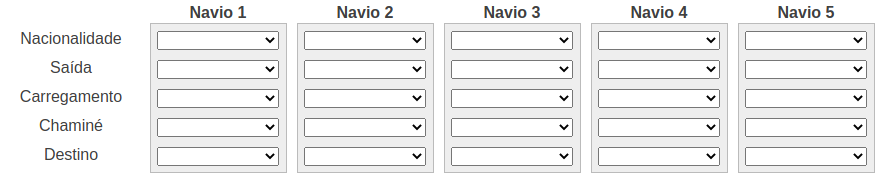
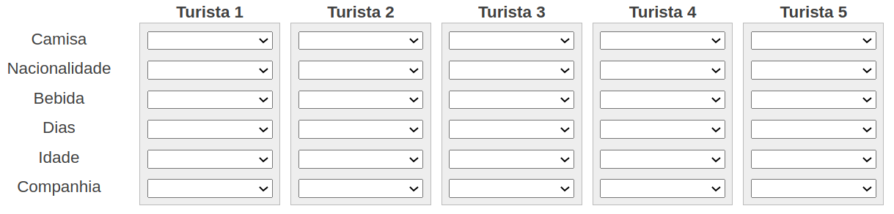

# PrologPuzzle

Vamos utilizar o Prtolog para encontrar a solução de problemas de lógica.

## Navios no Porto

Encontre a nacionalidade, origem, bandeira, destino e horário de partida de cada um dos 5 navios.

O navio **Grego sai às 6 da manhã e carrega Café**.
O navio **do meio tem a chaminé Preta**.
O navio **Inglês sai às 9 da manhã**.
O navio **Francês, que tem a chaminé Azul, está à esquerda do navio que carrega Café**.
**À direita do navio que carrega Cacau** está o **navio que vai para Macau**.
O navio **Brasileiro** está **indo para Manila**.
O navio que **carrega Arroz** está **ancorado ao lado do navio com chaminé Verde**.
O navio que **vai para Santos sai às 5 da manhã**.
O navio **Espanhol sai às 7 da manhã** e está **à direita do navio que vai para Macau**.
O navio com a **chaminé Vermelha vai para Hamburgo**.
O navio que **sai às 7 da manhã** está ao **lado do navio que tem a chaminé Branca**.
O navio **do canto carrega Milho**.
O navio com **chaminé Preta sai às 8 da manhã**.
O navio que **carrega Milho** está ancorado **ao lado do navio que carrega Arroz**.
O navio que vai para **Hamburgo sai às 6 da manhã**.

## Turistas na Copa

Cinco turistas europeus acabaram de chegar no Brasil para acompanhar a Copa e conhecer o Brasil. use as dicas para descobrir as características deles.

Cinco turistas europeus estão lado a lado no aeroporto no Brasil. Eles vieram para cá para torcerem por suas seleções e conhecer o Brasil durante a Copa de 2014. Cada um passará uma certa quantidade de dias no país e veio acompanhado de uma pessoa.
Confira atentamente cada dica e use a lógica para descobrir as características desses turistas.

* Na primeira posição está quem **ficará 15 dias no Brasil**.
* O Turista da **camisa Verde está em algum lugar entre quem gosta de Água e o Croata, nessa ordem**.
* O **Alemão** está **acompanhado do Filho**.
* O **espanhol** é o turista **mais velho**.
* O turista de **45 anos** está exatamente **à direita do turista de 31 anos**.
* O **Alemão** está **exatamente à esquerda do turista de Vermelho**.
* O turista de **36 anos** está exatamente à **esquerda do turista que gosta de Leite**.
* O Turista do **meio** está acompanhado do amigo.
* O Turista de **azul** está do lado do turista que **ficará 10 dias no Brasil**.
* O **Italiano** está na **terceira posição**.
* O **turista de Azul** está ao **lado do turista que ficará 10 dias no Brasil**.
* O **Italiano está na terceira posição**.
* O **Alemão** está **ao lado do turista que passará 20 dias no Brasil**.
* O **turista de 28 anos** está **exatamente à direita do turista que ficará 25 dias no Brasil**.
* O **turista de Verde** está **em algum lugar entre o Espanhol e o turista de Branco, nessa ordem**.
* **Quem gosta de Chá está exatamente à esquerda de quem veio acompanhado do Amigo**.
* Na **quinta posição** está o **turista que veio com a Namorada**.
* Quem está **acompanhado da Esposa** está **ao lado de quem ficará 20 dias no Brasil**.
* O **turista que gosta de Café está na quinta posição**.
* O **turista que veio com a Esposa está exatamente à esquerda de quem gosta de Leite**.
* Os **turistas das camisas amarela e vermelha estão lado a lado**.
* O **turista de 31 anos veio com o Amigo**.
